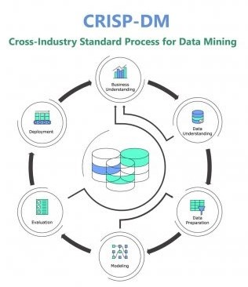
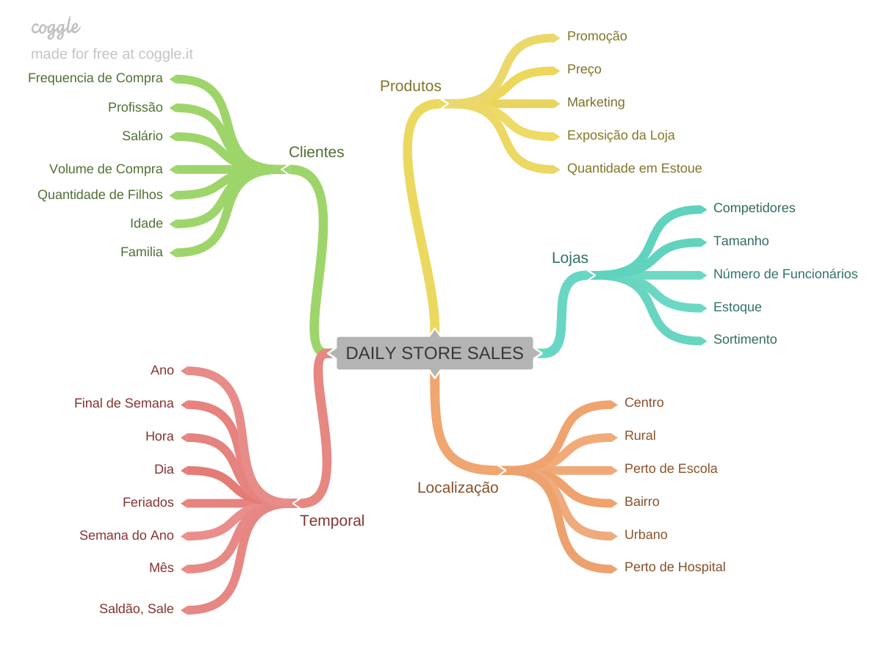
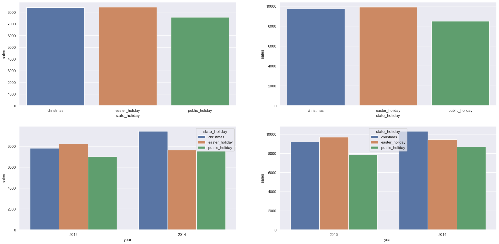
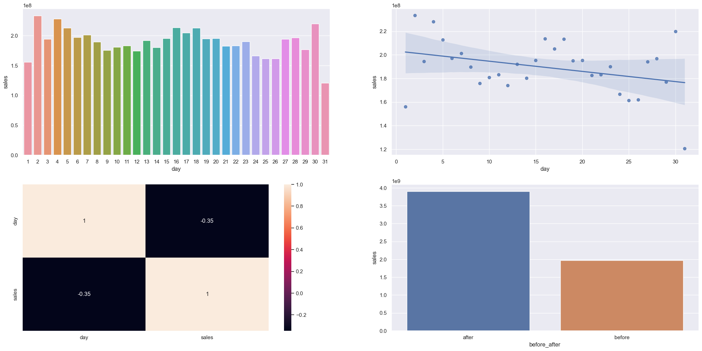
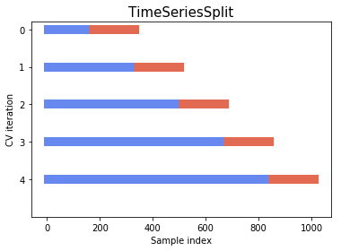
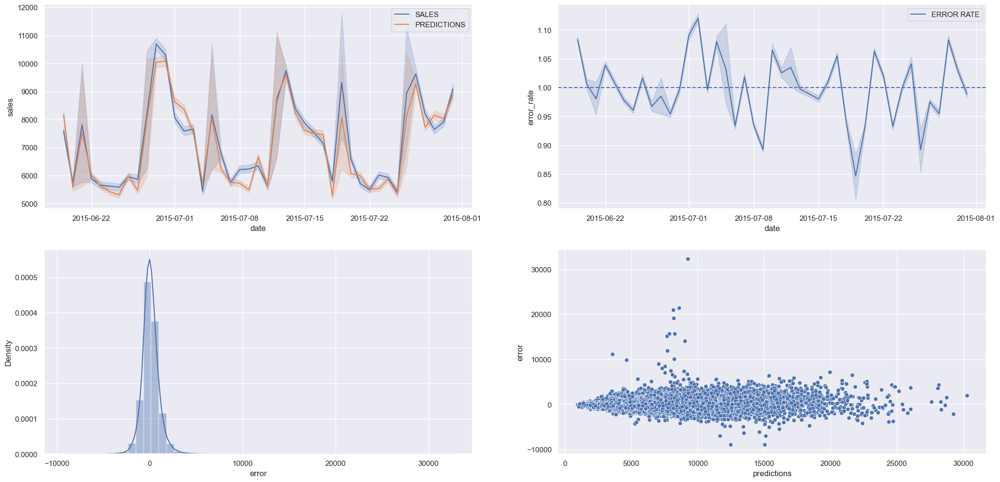
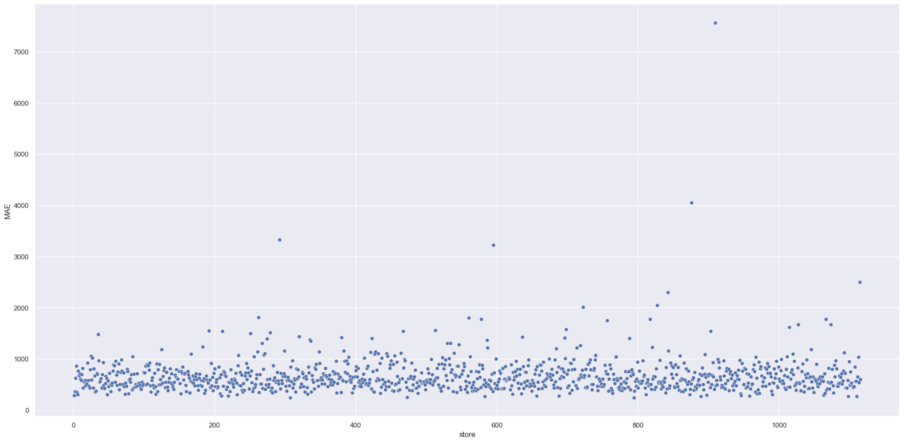

# Previsão de Vendas para a Rede de Farmácias Rossmann

A Rossmann, uma empresa com uma presença sólida no mercado europeu, operando mais de 3.000 farmácias em sete países e contando com uma equipe de aproximadamente 56 mil colaboradores, apresenta um desafio significativo e estratégico.

Esta iniciativa surge em resposta ao cenário atual no qual a empresa busca melhorar a estrutura de suas lojas, visando aprimorar o atendimento ao público. O Chief Financial Officer (CFO) da Rossmann precisa tomar decisões precisas e ágeis para investir no processo de reforma de suas lojas. Para atingir esse objetivo, os gerentes de cada loja são responsáveis por fornecer projeções de receita para as próximas seis semanas.

Entretanto, o desafio reside no fato de que essas previsões são calculadas de maneira individual e manual, levando em consideração as particularidades de cada loja, como promoções, competição por clientes, feriados, sazonalidade, entre outros fatores. Isso resulta em variações substanciais nos resultados apresentados.

## Solução do Problema

Este projeto tem como objetivo principal auxiliar o CFO da Rossmann na tomada de decisões estratégicas, oferecendo previsões automáticas e precisas para cada uma das lojas. Além disso, proporcionará ao CFO a facilidade de acessar essas projeções por meio de um Bot no aplicativo Telegram.

## Premissas de Negócio

Para a construção desta solução, consideramos as seguintes premissas:

- A previsão de vendas estará disponível 24 horas por dia, 7 dias por semana, acessível através do aplicativo Telegram. O CFO poderá inserir o código da loja e receberá, como resposta, o valor da previsão para as próximas seis semanas.
- Foram incluídas na previsão apenas as lojas que apresentaram valores de vendas superiores a zero na base de dados.
- Os dias em que as lojas estiveram fechadas foram excluídos do cálculo da previsão.
- Para as lojas que não possuíam dados sobre competidores próximos, foi considerada uma distância fixa de 200.000 metros.

Esta solução não apenas simplificará o processo de tomada de decisão, mas também garantirá uma maior precisão nas projeções de vendas, permitindo que a Rossmann otimize seus recursos de maneira eficaz e alcance um novo patamar de excelência em seu mercado.

## Descrição dos Dados

| Atributo                          | Descrição                                                                                                                                             |
| :-------------------------------- | :---------------------------------------------------------------------------------------------------------------------------------------------------- |
| Store                             | Identificador único de cada loja                                                                                                                      |
| Date                              | Data em que ocorreu o evento de venda                                                                                                                 |
| DayOfWeek                         | Variável numérica que representa o dia da semana                                                                                                      |
| Sales                             | Valor de vendas do dia                                                                                                                                |
| Customers                         | Quantidade de clientes na loja no dia                                                                                                                 |
| Open                              | Indicador para loja aberta = 1 ou fechada = 0                                                                                                         |
| StateHoliday                      | Indica se o dia é feriado de estado. a = Feriado público, b = Feriado de páscoa, c = Natal, 0 = Não há feriado                                        |
| SchoolHoliday                     | Indica se a loja foi ou não fechada durante o feriado escolar                                                                                         |
| StoreType                         | Indica o modelo de lojas. Pode variar entre a, b, c, d                                                                                                |
| Assortment                        | Indica o nível de variedade de produtos: a = básico, b = extra, c = estendido                                                                         |
| CompetitionDistance               | Distância (em metros) para o competidor mais próximo                                                                                                  |
| CompetitionOpenSince [Month/Year] | Indica o ano e mês em que o competidor mais próximo abriu                                                                                             |
| Promo                             | Indica se a loja está com alguma promoção ativa no dia                                                                                                |
| Promo2                            | Indica se a loja deu continuidade na promoção: 0 = loja não está participando, 1 = loja participando                                                  |
| Promo2Since [Year/Week]           | Descreve o ano e semana de quando a loja começa a a promoção extendida                                                                                |
| PromoInterval                     | Descreve os meses em que a loja iniciou a promo2, ex.: "Feb,May,Aug,Nov" significa que a loja iniciou as promoções estendidas em cada um desses meses |

## Estratégia da Solução

### Metodologia CRISP-DS

Nossa abordagem para fornecer rapidamente uma solução valiosa à empresa e capacitar o CFO com informações ágeis baseia-se na metodologia CRISP-DM aplicada a Ciência de Dados.

O CRISP-DS é um processo cíclico com nove etapas, onde aprimoramos constantemente os resultados de negócios. Isso nos permite entregar resultados cada vez mais rápidos, com maior qualidade e precisão. O objetivo é fornecer às equipes que utilizarão os resultados um produto minimamente utilizável na primeira entrega e aperfeiçoá-lo ao longo do tempo.

#### Passos do CRISP-DS:

1. **Problema de Negócio:** Nesta etapa, recebemos a definição do problema de negócio a ser resolvido. Aqui, estamos atendendo à pergunta ou solicitação do responsável pelo problema, que, neste projeto, é o CFO da rede Rossmann.

2. **Entendimento de Negócio:** O objetivo desta etapa é compreender a dor do responsável pelo problema e suas reais necessidades. Podem ser desenvolvidos protótipos da solução para validar as expectativas do cliente.

3. **Coleta de Dados:** Aqui, coletamos os dados nas tabelas do banco de dados da empresa.

4. **Limpeza dos Dados:** Esta etapa visa eliminar qualquer inconsistência nos dados que possa afetar o desempenho dos algoritmos de Machine Learning. É fundamental garantir que dados importantes não sejam inadvertidamente removidos.

5. **Exploração dos Dados:** Nesta fase, analisamos os dados e suas relações. Também formulamos hipóteses de negócio que podem ser validadas por meio de análises de dados e criamos novos recursos para a modelagem de dados.

6. **Modelagem dos Dados:** Preparamos os dados para o uso em algoritmos de Machine Learning, aplicando transformações e codificações para facilitar o aprendizado dos algoritmos.

7. **Aplicação de Algoritmos de Machine Learning:** Nesta etapa, selecionamos e aplicamos algoritmos de Machine Learning aos dados preparados, comparando seu desempenho e escolhendo o melhor algoritmo.

8. **Avaliação de Performance:** Verificamos o desempenho do algoritmo escolhido em relação aos resultados atuais ou à linha de base atual. Traduzimos esse desempenho em termos de impacto financeiro para a empresa. Se a performance for aceitável, o algoritmo é publicado; caso contrário, retornamos à etapa de entendimento de negócio para melhorias.

9. **Publicação da Solução:** Nesta fase, publicamos o algoritmo selecionado, tornando a solução disponível para uso.

### Produto Final

Em acordo com o CFO, entregaremos um bot dentro do aplicativo Telegram para facilitar a consulta das previsões das lojas, independentemente de sua localização. Além disso, durante o desenvolvimento do produto final, criaremos uma API que retornará as previsões das lojas, utilizando o modelo de Machine Learning desenvolvido.

## Ferramentas Utilizadas

Utilizamos as seguintes ferramentas para desenvolver a solução:

- Linguagem de Programação Python versão 3.8.10
- Controle de versão Git
- Aplicação Jupyter Notebook para prototipagem
- Serviço de Hospedagem em Nuvem Render
- Técnicas de manipulação de dados em Python
- Técnicas de redução de dimensionalidade e seleção de atributos
- Algoritmos de Machine Learning da biblioteca scikit-learn em Python

## Top 3 Insights

Com base nesse Mindmap, geramos 19 hipóteses de negócio, validando 12 delas. Isso confirmou as suposições da equipe de negócios e do responsável pelo problema, além de gerar insights valiosos.

Dos 12 insights verificados, os três principais foram:

1. **Insight 1:** Lojas Abertas durante o Feriado de Natal Deveriam Vender Mais
   - Hipótese Falsa: Lojas que permanecem abertas durante o feriado de Natal não vendem mais em comparação a outros feriados.
   - Gráfico da Hipótese 1
     

2. **Insight 2:** Lojas Deveriam Vender Mais Após o Dia 10 de Cada Mês
   - Hipótese Verdadeira: Lojas realmente vendem mais após o dia 10 de cada mês.
   - Gráfico da Hipótese 2
     

3. **Insight 3:** Lojas Deveriam Vender Mais no Segundo Semestre do Ano
   - Hipótese Falsa: Lojas vendem MENOS no segundo semestre do ano.
   - Gráfico da Hipótese 3
     

Esses insights oferecem informações valiosas que podem orientar as decisões de negócios e estratégias futuras da Rossmann.

## Modelos de Machine Learning

No primeiro ciclo deste projeto, escolhemos cuidadosamente cinco algoritmos para testes, visando selecionar o que apresentasse o melhor desempenho e custo de implementação. Optamos por uma abordagem inicialmente simples, considerando que este era o ponto de partida do projeto. Nossa meta principal era entregar uma solução minimamente utilizável para a equipe de negócios e o CFO.

Os algoritmos escolhidos foram os seguintes:

- Average Model
- Linear Regression
- Linear Regression - Lasso
- Random Forest Regressor
- XGBRegressor

Realizamos treinamentos e testes com cada um deles para avaliar seu desempenho. Adicionalmente, aplicamos o método de seleção de recursos Boruta para auxiliar na escolha das características mais relevantes da base de dados.

## Seleção do Modelo de Machine Learning

### Escolha da Métrica

Utilizamos a métrica MAPE (Mean Absolute Percentage Error) como critério de seleção entre os algoritmos, pois essa métrica é mais compreensível para a equipe de negócios e o CEO, representando a porcentagem de erro em relação ao valor médio.

### Métricas dos Algoritmos

Após os testes iniciais, obtivemos os seguintes resultados:

| Nome do Modelo | MAE         | MAPE        | RMSE          |
|----------------|-------------|-------------|---------------|
| Avarege Model  | $1354.800   | 0.455051    | $1835.135     |
| Linear Regression | $1867.089 | 0.292694 | $2671.049 |
| Linear Regression - Lasso | $1891.704 | 0.289106 | $2744.451 |
| Random Forest Regressor | $679.893 | 0.099967 | $1011.038 |
| XGBRegressor   | $865.127    | 0.124905    | $1278.188    |

### Métricas dos Algoritmos - Cross Validation

Além dos testes com os algoritmos selecionados, aplicamos a técnica de Cross Validation para validar os resultados e garantir a real performance de cada modelo. Dado que o problema envolvia séries temporais, utilizamos uma técnica específica de Cross Validation para respeitar a ordem temporal dos dados.

Com essa técnica, obtivemos as seguintes performances:

| Nome do Modelo | MAE CV            | MAPE CV           | RMSE CV              |
|----------------|-------------------|-------------------|----------------------|
| Linear Regression | 2081.73 +/- 295.63 | 0.3 +/- 0.02 | 2952.52 +/- 468.37 |
| Linear Regression Regularized | 2116.38 +/- 341.5 | 0.29 +/- 0.01 | 3057.75 +/- 504.26 |
| Random Forest Regressor | 837.66 +/- 218.22 | 0.12 +/- 0.02 | 1255.81 +/- 318.76 |
| XGBoost Regressor | 1045.83 +/- 182.93 | 0.14 +/- 0.02 | 1509.2 +/- 260.07 |

### Escolha do Modelo

Embora o algoritmo Random Forest Regressor tenha apresentado o melhor desempenho, optamos pelo XGBoost Regressor nesta fase. Essa escolha foi baseada em três motivos principais:

1. A diferença de desempenho entre esses dois algoritmos é pequena.
2. O XGBoost Regressor possui um tempo de treinamento mais rápido em comparação ao Random Forest Regressor.
3. O modelo final treinado com o XGBoost Regressor ocupa menos espaço, resultando em custos menores em servidores em nuvem.

### Ajuste de Hiperparâmetros

Para encontrar os melhores hiperparâmetros, utilizamos a técnica de Random Search. Realizamos diversos testes, com destaque para os parâmetros da "Teste 4", que foram selecionados como os mais adequados para o treinamento do modelo.

### Performance do Modelo

Como demonstrado nos gráficos, o modelo selecionado apresentou uma performance aceitável. Ele foi capaz de capturar e replicar o padrão de vendas ao longo do período estudado. Além disso, as previsões do modelo exibem uma distribuição normal, indicando resultados sólidos e uma distribuição equilibrada de erros.

## Resultados de Negócios

Com o modelo selecionado e treinado, obtivemos a seguinte performance de negócios para as cinco melhores lojas:

**Desempenho das Melhores Lojas:**

| ID da Loja | Previsões | Pior Cenário | Melhor Cenário | MAE     | MAPE   |
|------------|-----------|---------------|-----------------|---------|--------|
| 259        | $542,261.00 | $541,643.54 | $542,878.46 | $617.46 | 0.0483 |
| 990        | $235,996.80 | $235,689.77 | $236,303.82 | $307.03 | 0.0485 |
| 1089       | $378,721.16 | $378,205.41 | $379,236.90 | $515.75 | 0.0488 |
| 1097       | $440,957.44 | $440,370.68 | $441,544.20 | $586.76 | 0.0541 |
| 667        | $314,811.66 | $314,324.37 | $315,298.95 | $487.29 | 0.0551 |

É importante destacar que algumas lojas apresentaram resultados insatisfatórios, e planejamos abordá-las individualmente em iterações futuras para identificar as causas e melhorar o desempenho. As cinco piores lojas tiveram a seguinte performance:

**Desempenho das Piores Lojas:**

| ID da Loja | Previsões | Pior Cenário | Melhor Cenário | MAE     | MAPE   |
|------------|-----------|---------------|-----------------|---------|--------|
| 292        | $103,891.24 | $100,561.08 | $107,221.41 | $3,330.17 | 0.562  |
| 909        | $237,516.14 | $229,953.85 | $245,078.43 | $7,562.29 | 0.511  |
| 876        | $206,953.81 | $202,905.53 | $211,002.09 | $4,048.28 | 0.316  |
| 722        | $353,882.56 | $351,866.71 | $355,898.42 | $2,015.85 | 0.268  |
| 274        | $195,549.67 | $194,157.14 | $196,942.21 | $1,392.54 | 0.244  |

## Distribuição das Previsões por Loja

## Conclusões

Este projeto resolveu com sucesso o problema inicial de previsão de faturamento das lojas, que anteriormente era feito manualmente pelos gerentes. Além disso, a criação do BOT para o aplicativo de mensagens Telegram proporcionou maior agilidade na obtenção de informações para o CFO.

## Lições Aprendidas

Durante o projeto, aprendemos várias lições valiosas, incluindo:

- A importância de priorizar tarefas e soluções.
- A eficácia de abordagens de desenvolvimento cíclico, permitindo entregas mais rápidas.
- A capacidade de criar um BOT para o aplicativo de mensagens Telegram, melhorando o acesso às informações.

## Próximos Passos

Para as próximas etapas do projeto, planejamos:

- Investigar as razões por trás do desempenho ruim de algumas lojas.
- Explorar outros algoritmos de Machine Learning no próximo ciclo para melhorar a precisão das previsões.
- Desenvolver uma aplicação web usando o framework Streamlit para disponibilizar as previsões aos gerentes das lojas.
- Implementar testes unitários para garantir a qualidade do código.
- Criar novas características (features) para aprimorar o desempenho do modelo atual e futuros.
- Aplicar técnicas de otimização de desempenho à solução.
